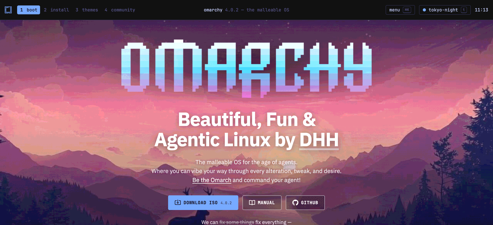

# Omarchy homepage redesign

A redesign proposal for [omarchy.org](https://omarchy.org) — the homepage as a tiled Hyprland workspace.



## Concept

The page *is* an Omarchy desktop:

- A waybar-style top bar — workspaces `1`–`4` anchor the sections, live clock, theme module.
- Content tiled as windows with focus-follows-mouse borders, each titled by the command that would produce it (`❯ fastfetch`, `❯ ls community/`, `❯ cat 07-hotkeys.md`).
- The ASCII wordmark rendered on canvas: it decrypts on load, scrambles under the cursor, and carries the original logo gradient — re-derived from the active theme's tokens.
- All 20 themes from the [omarchy repo](https://github.com/omacom/omarchy), palettes mapped 1:1 from `themes/*/colors.toml` — pick one in the gallery or cycle with `t`. The choice persists.
- A feature bento built from the manual's own chapters, and videos in a floating mpv-style window (native `<dialog>`).

One static file. No framework, no runtime dependencies — fonts, thumbnails, favicon and web manifest are inlined; the page works offline.

## Files

- `index.src.html` — the homepage source (markup, styles, scripts)
- `pages/` — one fragment per subpage: security, teams, patrons, sponsorships, air, meetups, workstations, brand
- `partials/` — the shared shell every subpage is wrapped in: head with bar and base styles, footer, base script
- `content/` — snapshots of the 51 manual chapters and 12 news articles from omarchy.org; `build.sh` turns them into pages with chapter toc, sidebars and prev/next
- `404.src.html` — error page source, same design language, no embedded fonts
- `build.sh` — inlines the assets, wraps fragments and content, emits `public/`
- `public/` — what gets deployed
- `assets/` — favicon, OG image, thumbnails, brand files and page images from omarchy.org, JetBrains Mono woff2 in `fonts/`
- `wrangler.jsonc` — Cloudflare Workers static-assets config (custom domain, 404 handling)

## Develop

Edit a source file, run `sh build.sh`, then serve `public/` locally — the site uses absolute paths, so use a server rather than opening files directly:

```sh
python3 -m http.server 8000 -d public
```

Then visit http://localhost:8000.

## Attribution

This is an unsolicited design proposal for [omarchy.org](https://omarchy.org). All Omarchy content, imagery and branding — the wordmark, logo, manual, news, photos — belongs to the Omarchy project and the Omacom Foundation; Omarchy is a pending trademark. JetBrains Mono ships under the SIL Open Font License (`fonts/OFL.txt`).

---

Designed & developed by Daniel Schmier — [captainscor.ch](https://captainscor.ch)
